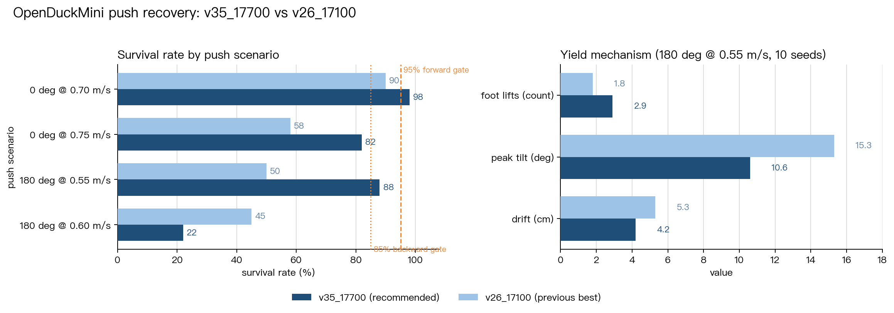
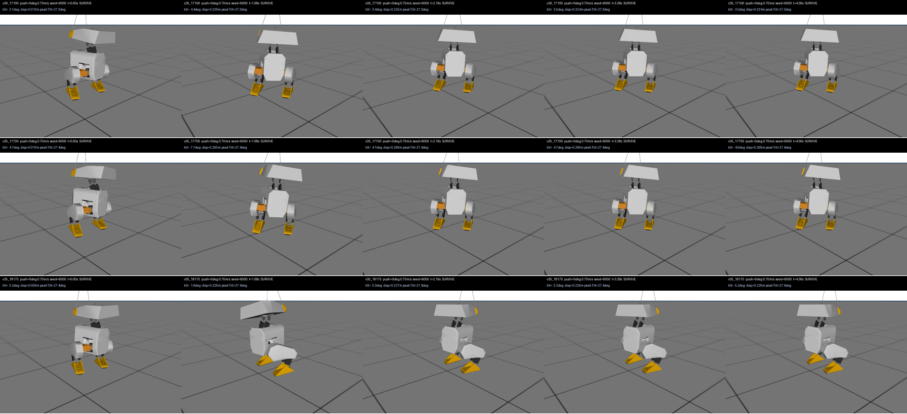
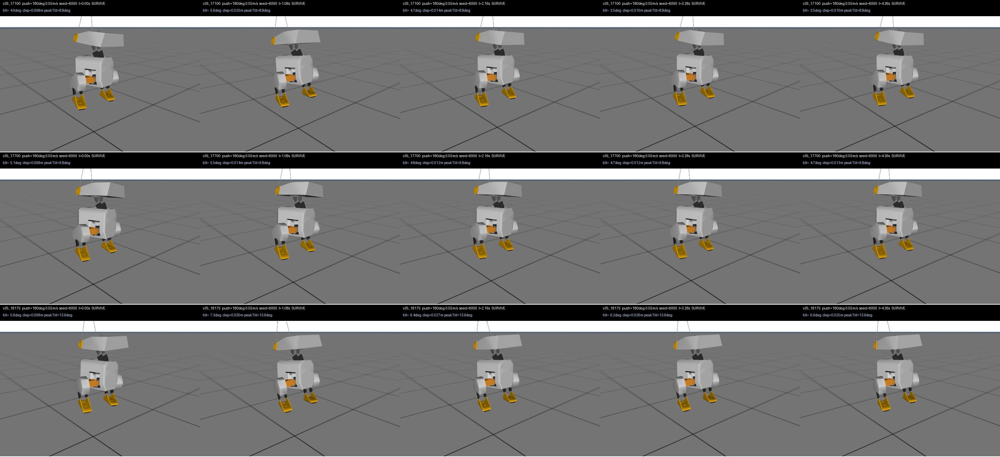

# OpenDuckMini 抗推恢复（Push Recovery）

四足鸭子机器人 OpenDuckMini 的**抗推恢复**训练与评测：用纯 PPO（rsl_rl
`OnPolicyRunner`）+ CPU MuJoCo 向量化环境（128 环境），让机器人被侧向/前后向
扰动推击后自行恢复站立。

本仓库是该项目的**精简公开版**，只保留可复现的核心：规范环境、训练入口、
评测协议、实验记录，以及推荐的交付权重。原始工程含数 GB 中间 checkpoint 与
几十轮实验快照，未收入此处。

## 结果速览

推荐模型 `models/v35_17700.pt`，评测协议：60 seeds、`seed0=6000`、
`reset_noise=0.03`、冲量语义（train）。存活率取自
[`docs/v35_chart_data_s60.txt`](docs/v35_chart_data_s60.txt)。

| 工况 | v35_17700（本仓库） | 说明 |
|---|---|---|
| 0° @ 0.55 | 100% | 前向 |
| 0° @ 0.70 | 98% | 前向硬门槛 ≥95% |
| 0° @ 0.75 | 82% | 分布外推 |
| 180° @ 0.55 | 88% | 后向 |
| 180° @ 0.60 | 22% | 已知短板 |
| 180° @ 0.70 | 0% | 物理前沿 |



左图比较 60-seed 存活率；右图是后向 0.55 推力下的恢复机制画像。相比旧最佳
`v26_17100`，`v35_17700` 在关键门槛上有明显提升，同时用更小的峰值倾角和漂移完成恢复。

关键结论：v35_17700 是唯一同时满足「前向 0.70 ≥ 95%」和「后向 0.55 ≥ 85%」
的检查点。它的抗推机制是**卸力让位**而不是死扛——被推时抬脚换重心，峰值倾角
更小、漂移更少（180°@0.55：抬脚 2.9 次 vs 基线 1.8 次，峰值倾角 10.6° vs
15.3°）。完整推导见 [`docs/V36_EXPERIMENT.md`](docs/V36_EXPERIMENT.md)。

### 恢复过程

每行一个模型、从左到右逐帧展示被推后的恢复过程。自上到下依次为
`v26_17100`、`v35_17700` 和前向备选 `v35_18175`。



前向 0.70 m/s：`v35_17700` 的峰值倾角更小。



后向 0.55 m/s：`v35_17700` 通过抬脚换重心，后向恢复成功率从 50% 提升到 88%。

> 注意：这条训练线的检查点摆动极大，好点常出现在中途而非终版，**不要拿
> `model_final` 直接当交付**。本仓库只附带被 60-seed 评测选中的
> `v35_17700`。

## 快速开始

依赖：Python ≥ 3.10、CPU 即可（无需 GPU）。

```bash
pip install -r requirements.txt
```

评测推荐模型（60 seeds，约几分钟）：

```bash
python eval/eval_push_modes.py \
  --ckpt models/v35_17700.pt \
  --angles 0 180 --mags 0.55 0.60 0.70 0.75 \
  --seeds 60 --seed0 6000 --reset-noise 0.03
```

持续推力语义（更接近真人手推）：

```bash
python eval/eval_push_sustain.py --ckpt models/v35_17700.pt \
  --angles 180 --mags 0.70 0.80 --dur 0.30 --seeds 60 --seed0 6000 --reset-noise 0.03
```

训练冒烟测试（16 环境 × 5 迭代，训练前必跑）：

```bash
python train.py --smoke --task push_recovery
```

可视化（macOS 下 `launch_passive` 需要 `mjpython`）：

```bash
mjpython play_live.py models/v35_17700.pt
```

## 评测协议（不遵守的话数字就是错的）

1. **必须 60 seeds**。20 seeds 在 0.70/0.75 这种翻转阈值上噪声约 ±15pp，
   会把结论带偏。
2. **不要复用 env 实例**。MuJoCo 的 `qacc_warmstart` 残留会让存活率虚高，
   每个 episode 都要新建环境（本仓库脚本默认如此，`--reuse-env` 仅供诊断）。
3. **单种子渲染只能看机制，不能读概率**。
4. 拿上游 checkpoint 当基线时直接指向该文件：`--resume` 后第 0 个存档点
   已多走一步 PPO 更新。

## 仓库结构

```
duck_vec_env.py       规范环境（与 v35_17700 同源）：MuJoCo CPU 向量化、
                      域随机化、课程学习、51D/55D 观测契约
duck_vec_env_v47.py   最新实验环境（含 catch_step / 势函数塑形），仅作参考
train.py              训练入口（rsl_rl OnPolicyRunner + PPO，CPU，128 envs）
play.py / play_live.py 可视化与交互推扰 viewer
eval/                 评测脚本：瞬时/持续推力存活率、卸力机制画像、权重插值
docs/                 实验记录与版本排名
models/               推荐交付权重 v35_17700.pt
assets/xmls/          OpenDuckMini MJCF 场景与 mesh（来自上游 Apache-2.0）
charts/               关键对比图
training_logs/        v35 训练日志
```

## 环境设计要点

- 固定观测契约：actor 51D / critic 55D，扩展只能加槽不能删槽。
- 零指令显式采样，站立行为必须被训练。
- 域随机化在 reset 时「恢复-再施加」，绝不跨回合累积。
- 课程按 PPO 更新次数推进：指令范围渐宽、推力晚引入。
- 关节编码器偏置加在观测上——策略看到的就是真机编码器视图。

## 已知局限

- 后向 0.60 是物理前沿：现有策略在该档位跌到 22%。多轮实验表明，前向
  0.70/0.75「制动式站住」与后向 0.60「让位卸力」在 20ms 控制周期下互斥。
  进一步突破建议从扰动建模（冲量摊平、足底摩擦-旋转耦合）入手，而不是继续
  加大后向训练幅度。
- 评测是**分布外推**：项目训练课程末段推力仅 0.30 m/s，而评测压到
  0.70/0.75。

## 说明

- 机器人 MJCF 与 mesh 资产来自 Open Duck Mini（Apache-2.0），详见 `NOTICE`。
- 实验记录（`docs/`）保留原始中文，未做翻译。

---

### English summary

Push-recovery training and evaluation for the OpenDuckMini quadruped, using
plain PPO (rsl_rl `OnPolicyRunner`) with a CPU MuJoCo vectorized environment
(128 envs). The recommended checkpoint `models/v35_17700.pt` reaches 98% at
forward 0.70 and 88% at backward 0.55 (60-seed protocol), recovering pushes by
stepping to yield the center of mass rather than bracing against them. See
`docs/` for the experiment log (Chinese). Robot MJCF assets come from the
upstream Open Duck Mini project (Apache-2.0).
